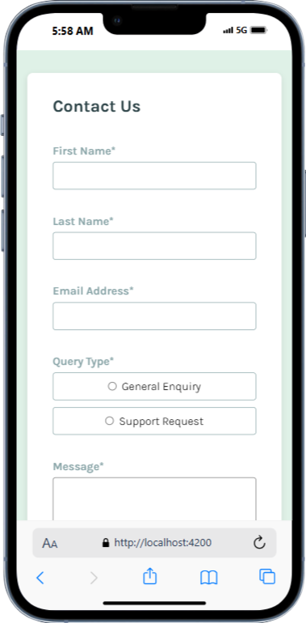

# Frontend Mentor - Contact form

## Table of contents

- [Frontend Mentor - Contact form](#frontend-mentor---contact-form)
  - [Table of contents](#table-of-contents)
  - [Overview](#overview)
    - [The challenge](#the-challenge)
    - [Screenshot](#screenshot)
    - [Links](#links)
  - [My process](#my-process)
    - [Built with](#built-with)
  - [Author](#author)

## Overview

### The challenge

Your challenge is to build out this contact form and get it looking as close to the design as possible. Pay particular attention to making this form accessible. Building accessible forms is a key skill for front-end developers. So this is a perfect challenge to practice.

You can use any tools you like to help you complete the challenge. So if you've got something you'd like to practice, feel free to give it a go.

Your users should be able to: 

- Complete the form and see a success toast message upon successful submission
- Receive form validation messages if:
  - A required field has been missed
  - The email address is not formatted correctly
- Complete the form only using their keyboard
- Have inputs, error messages, and the success message announced on their screen reader
- View the optimal layout for the interface depending on their device's screen size
- See hover and focus states for all interactive elements on the page

### Screenshot

### Links

- Solution URL: [Github](https://github.com/Gandah/my-ngapp)
- Live Site URL: [Contact Form](https://contact-form-kappa-azure.vercel.app)

## My process

### Built with

- Angular
- CSS custom properties
- Flexbox
- CSS Grid

Use this section to recap over some of your major learnings while working through this project. Writing these out and providing code samples of areas you want to highlight is a great way to reinforce your own knowledge.

To see how you can add code snippets, see below:

## Author

- Frontend Mentor - [@Gandah](https://www.frontendmentor.io/profile/Gandah)
- LinkedIn - [Gandah](https://www.linkedin.com/in/gandahkelvin/)

